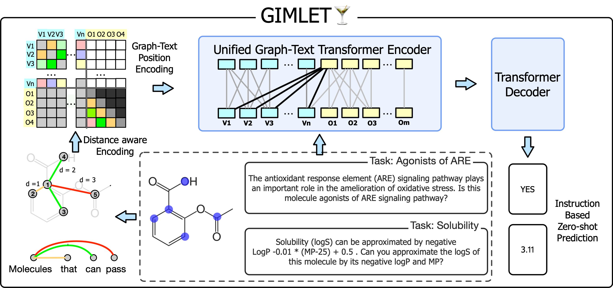
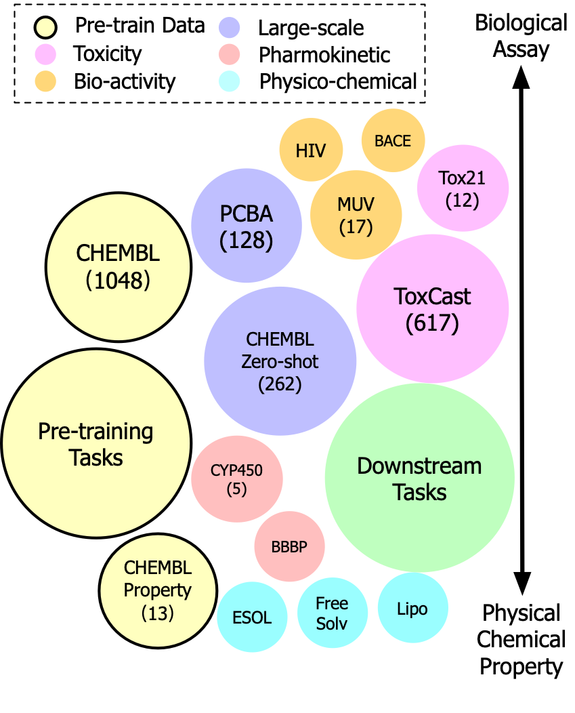

# GIMLET


This is the code for paper [GIMLET: A Unified Graph-Text Model for Instruction-Based Molecule Zero-Shot Learning](https://arxiv.org/pdf/2306.13089.pdf) published at NeurIPS 2023.

GIMLET is a unified transformer model for both graph and text data and is pretrained on large scale molecule tasks with instructions, towards instruction-based molecule zero-shot learning. The framework and pretraining & downstream tasks are as follows:

|   | |
|--|--|
|  |  |


We also benchmark baselines including KVPLM, MoMu, and Galactica on our downstream tasks for instruction-based zero-shot learning.


## Updates

### 2023.9.24

Out work has been accepted at NeurIPS 2023! The camera ready paper is at [https://proceedings.neurips.cc/paper_files/paper/2023/file/129033c7c08be683059559e8d6bfd460-Paper-Conference.pdf](https://proceedings.neurips.cc/paper_files/paper/2023/file/129033c7c08be683059559e8d6bfd460-Paper-Conference.pdf).

### 2023.7.10

**1.** Now the datasets and the GIMLET model can be download directly from HuggingFace  🤗 : [https://huggingface.co/datasets/haitengzhao/molecule_property_instruction](https://huggingface.co/datasets/haitengzhao/molecule_property_instruction) and [https://huggingface.co/haitengzhao/gimlet](https://huggingface.co/haitengzhao/gimlet).

The GIMLET model can be downloaded and used as follows:

```
from model import GraphT5TransformerForConditionalGeneration
model = GraphT5TransformerForConditionalGeneration.from_pretrained("haitengzhao/gimlet")
```

Our datasets can be downloaded and used as follows:

```
from datasets import load_dataset
dataset = load_dataset("haitengzhao/molecule_property_instruction")
```

We have made updates to the pipeline and scripts to accommodate the new loading methods. Try out the new implementation in your projects and enjoy the improved experience!

**2.** A few bugs in KVPLM testing have been fixed.

## Installation
To run GIMLET, please clone the repository to your local machine and install the required dependencies using the script provided.

Please note that the environment initialization script is for CUDA 11.1. If you are using a different version of CUDA, please adjust the package version in script as necessary.
### Environment
```
conda create -n env_gimlet python=3.7

source activate env_gimlet

pip3 install torch==1.9+cu111 torchaudio  -f https://download.pytorch.org/whl/cu111/torch_stable.html

wget https://data.pyg.org/whl/torch-1.9.0%2Bcu111/torch_scatter-2.0.9-cp37-cp37m-linux_x86_64.whl
pip install torch_scatter-2.0.9-cp37-cp37m-linux_x86_64.whl
wget https://data.pyg.org/whl/torch-1.9.0%2Bcu111/torch_sparse-0.6.12-cp37-cp37m-linux_x86_64.whl
pip install torch_sparse-0.6.12-cp37-cp37m-linux_x86_64.whl
wget https://data.pyg.org/whl/torch-1.9.0%2Bcu111/torch_cluster-1.5.9-cp37-cp37m-linux_x86_64.whl
pip install torch_cluster-1.5.9-cp37-cp37m-linux_x86_64.whl
wget https://data.pyg.org/whl/torch-1.9.0%2Bcu111/torch_spline_conv-1.2.1-cp37-cp37m-linux_x86_64.whl
pip install torch_spline_conv-1.2.1-cp37-cp37m-linux_x86_64.whl

pip install torch_geometric==1.7.2

git clone -b v4.28.1 https://github.com/huggingface/transformers

cd transformers
pip install --editable ./
python setup.py build_ext --inplace
cd ..

pip install datasets
pip install evaluate

pip install ogb
pip install spacy
pip install tqdm
pip install sklearn
pip install SentencePiece
pip install lmdb
pip install tensorboardX==2.4.1
pip install rdkit-pypi==2021.9.3
pip install dgl==0.7.2 -f https://data.dgl.ai/wheels/repo.html
pip install wandb
pip install networkx
pip install setuptools==59.5.0
pip install multiprocess
pip install Cython
pip install plotly
pip install commentjson
pip install pandas
pip install boto3
pip install chainer-chemistry
pip install subword-nmt
pip install pytorch_lightning==1.0
pip install plotly
pip install -U kaleido
pip install openai
```


### Checkpoint Download

#### Method 1: HuggingFace

Our model can now be downloaded from HuggingFace  🤗 . To download the model parameters, you can simply specify **--model_name_or_path** as **haitengzhao/gimlet**. Here's an example:

```
from model import GraphT5TransformerForConditionalGeneration
model = GraphT5TransformerForConditionalGeneration.from_pretrained("haitengzhao/gimlet")
```

#### Method 2: Manual Download

You can also download pytorch_model.bin from [https://drive.google.com/file/d/1ROU4SLW2NF9EtT70JC_SHC1OZIPB90id/view?usp=sharing](https://drive.google.com/file/d/1ROU4SLW2NF9EtT70JC_SHC1OZIPB90id/view?usp=sharing) and move it to **.\ckpts\gimlet**. You can do this by the following scripts:

```
mkdir ckpts
cd ckpts
mkdir gimlet
cd gimlet

filename='pytorch_model.bin'
fileid='1ROU4SLW2NF9EtT70JC_SHC1OZIPB90id'
wget --load-cookies /tmp/cookies.txt "https://drive.google.com/uc?export=download&confirm=$(wget --quiet --save-cookies /tmp/cookies.txt --keep-session-cookies --no-check-certificate 'https://drive.google.com/uc?export=download&id=${fileid}' -O- | sed -rn 's/.confirm=([0-9A-Za-z_]+)./\1\n/p')&id=${fileid}" -O ${filename} && rm -rf /tmp/cookies.txt

cd ..
cd ..
```

In this case, the **--model_name_or_path**  refers to the path of the checkpoint directory, which is **ckpts/gimlet**.


### Dataset Download

#### Method 1: HuggingFace
Our datasets is available for download on HuggingFace  🤗 . You can automatically download the datasets and use the huggingface dataset pipeline by augment **--use_huggingface_pipeline**.

#### Method 2: Manual Download
Alternatively, you can run experiments from the original molecule datasets. In this pipeline, we will incorporate instruction text to the molecule data during the experimentation process.
The MoleculeNet datasets, which comprise pcba, bace, hiv, muv, tox21, toxcast, bbbp, esol, lipo, and freesolv, can be conveniently downloaded automatically upon the first run. Alternatively, you can manually download them by following the script below:

```
wget http://snap.stanford.edu/gnn-pretrain/data/chem_dataset.zip
unzip chem_dataset.zip
mv dataset property_data
```
Besides MoleculeNet, we also includes CYP450 which can be downloaded from [https://github.com/shenwanxiang/ChemBench/tree/master/src/chembench/data_and_index/CYP450](https://github.com/shenwanxiang/ChemBench/tree/master/src/chembench/data_and_index/CYP450). Please download CYP450.csv.gz and uncompress file CYP450.csv to ./property_data/cyp450/raw/CYP450.csv.


## Run Zero-Shot Downstream Tasks

The script to run one downstream task is 

```
CUDA_VISIBLE_DEVICES=0 python downstream_test.py --zero_shot  --transformer_backbone gimlet --model_name_or_path haitengzhao/gimlet  --tokenizer_name t5-small --dataset bace --runseed 5  --batch_size 40 --grad_accum_step 1  --transform_in_collator --only_test --use_huggingface_pipeline
```

You have the option to include the **--use_huggingface_pipeline** flag to utilize the HuggingFace dataset pipeline. This feature is applicable for both GIMLET and baseline models in downstream scenarios involving zero-shot and few-shot settings.


To execute all the downstream tasks, you can utilize the script downstream_test.sh. Running this script will generate results that will be written into the file "./cache/testing_$modelname.csv".
```
bash downstream_test.sh $device $backbone $modelname_or_path  ($few_shot_number) ($augment_type) 
```
For GIMLET:
```
bash downstream_test.sh 0 gimlet gimlet
```

You can also test baselines (KVPLM, MoMu and Galactica) by specifying the model. Note that to run [KVPLM](https://github.com/thunlp/KV-PLM) and [MoMu](https://github.com/ddz16/MoMu), you need to download their corresponding model file.

```
bash downstream_test.sh 0 kvplm ckpt_KV.pt

bash downstream_test.sh 0 momu littlegin=graphclinit_bert=scibert_epoch=299-step=18300.pt

bash downstream_test.sh 0 galactica facebook/galactica-125m
```

You can also test the instructions variations for GIMLET as following:

```
bash downstream_test.sh 0 gimlet_aug gimlet 0 rewrite
```

and for baselines:

```
bash downstream_test.sh 0 kvplm_aug ckpt_KV.pt 0 rewrite

bash downstream_test.sh 0 momu_aug littlegin=graphclinit_bert=scibert_epoch=299-step=18300.pt 0 rewrite
```

## Run Few-Shot Learning

You can run few-shot learning for all the downstream tasks by specify the few-shot number:

```
bash downstream_test.sh 0 gimlet_fewshot gimlet 128
```

You can also run few-shot learning for all the baselines (KVPLM, MoMu):


```
bash downstream_test.sh 0 kvplm_fewshot ckpt_KV.pt 128

bash downstream_test.sh 0 momu_fewshot littlegin=graphclinit_bert=scibert_epoch=299-step=18300.pt 128
```


## Run the Pretraining 

### Run the Pretraining

To reproduce the pretraining on Chembl and Chembl property datasets, you can run the following command:
```
CUDA_VISIBLE_DEVICES=0  python pretraining_gimlet.py --model_name_or_path t5-small --tokenizer_name t5-small  --transformer_backbone gimlet --do_train  --train_file haitengzhao/molecule_property_instruction   --transform_in_collator --per_device_train_batch_size 64 --gradient_accumulation_steps 1 --per_device_eval_batch_size 200   --line_by_line  --loss_reduction_method sentence --save_steps 10000 --output_dir ckpts/gimlet_new  
```

You can validate the pretrained model on the splitted Chembl dataset (Chembl Zero Shot):

```
CUDA_VISIBLE_DEVICES=0  python pretraining_gimlet.py --model_name_or_path ckpts/gimlet_new --tokenizer_name t5-small  --transformer_backbone gimlet --do_eval  --validation_file haitengzhao/molecule_property_instruction   --transform_in_collator --per_device_train_batch_size 64 --gradient_accumulation_steps 1 --per_device_eval_batch_size 200   --line_by_line  --loss_reduction_method sentence --save_steps 10000 --output_dir ckpts/gimlet_new  
```

You can run your own pretraining by specifying --train_file as your pretraining file, or imply your model into the pipeline.


### Reproducing the Pretraining Data Generation

You can reproduce the pretraining dataset generation if you want to imply your own instruction methods. The Chembl dataset can be downloaded and processed by the following steps:
```
cd prompt_data/

wget http://bioinf.jku.at/research/lsc/chembl20/dataPythonReduced.zip
unzip dataPythonReduced.zip
cd dataPythonReduced
wget http://bioinf.jku.at/research/lsc/chembl20/dataPythonReduced/chembl20Smiles.pckl
wget http://bioinf.jku.at/research/lsc/chembl20/dataPythonReduced/chembl20LSTM.pckl
cd ..
rm dataPythonReduced.zip
mkdir -p chembl_raw/raw
mv dataPythonReduced/* chembl_raw/raw
wget 'https://www.dropbox.com/s/vi084g0ol06wzkt/mol_cluster.csv?dl=1'
mv 'mol_cluster.csv?dl=1' chembl_raw/raw/mol_cluster.csv

python transform.py --input-dir chembl_raw/raw --output-dir chembl_full > transform.out

cd ..
```

The Chembl property dataset can be downloaded by

```
cd prompt_data

filename='mole_graph_property.csv'
fileid='1oLxIDOzp8MY0Jhzc1m6E7SCOVAZO5L4D'
wget --load-cookies /tmp/cookies.txt "https://drive.google.com/uc?export=download&confirm=$(wget --quiet --save-cookies /tmp/cookies.txt --keep-session-cookies --no-check-certificate 'https://drive.google.com/uc?export=download&id=${fileid}' -O- | sed -rn 's/.confirm=([0-9A-Za-z_]+)./\1\n/p')&id=${fileid}" -O ${filename} && rm -rf /tmp/cookies.txt

cd ..
```

Produce the pretraining dataset by the following script:

```
cd prompts
python generate_pretrain_dataset.py --generate_assay_text --generate_mole_text --split_non_overlap --add_negation --use_augmented_prompt
```

And merge the generated dataset together:

```
python generate_pretrain_dataset_merge.py --merge_file_list assay_graph_text_train_non_overlap_split_0.csv assay_graph_text_detail_train_non_overlap_split_0.csv assay_graph_text_expand_train_non_overlap_split_0.csv assay_graph_text_rewrite_train_non_overlap_split_0.csv assay_graph_text_shorten_train_non_overlap_split_0.csv property_graph_text_negative05_train_non_overlap_split_0.csv   property_graph_text_negative05_detail_train_non_overlap_split_0.csv property_graph_text_negative05_expand_train_non_overlap_split_0.csv property_graph_text_negative05_rewrite_train_non_overlap_split_0.csv property_graph_text_negative05_shorten_train_non_overlap_split_0.csv   --merge_file_policy custom --merge_file_ratio 1.0 1.0 1.0 1.0 1.0 1.0 0.25 0.25 0.25 0.25  --final_file_name merge_split0.csv
```

In this scenario, the pretraining data is the file "pretrain_datasets/merge_split0.csv". To validate the pretrained model, you can use the data file "pretrain_datasets/assay_graph_text_valid_non_overlap_split_0.csv". To specify these files as the training and validation data, use the arguments **--train_file** and **--validation_file** with their respective file paths.

## Citation

Please cite our paper if you find it helpful or use our datasets.
```
@article{zhao2024gimlet,
  title={Gimlet: A unified graph-text model for instruction-based molecule zero-shot learning},
  author={Zhao, Haiteng and Liu, Shengchao and Chang, Ma and Xu, Hannan and Fu, Jie and Deng, Zhihong and Kong, Lingpeng and Liu, Qi},
  journal={Advances in Neural Information Processing Systems},
  volume={36},
  year={2024}
}
```


